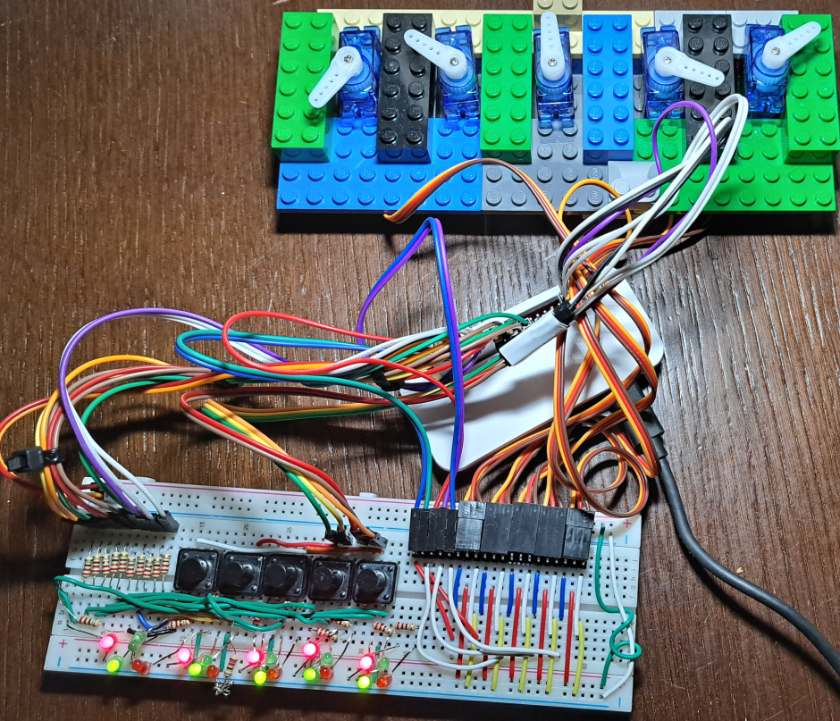
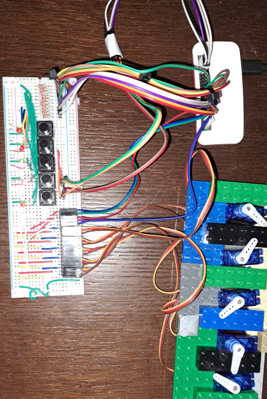
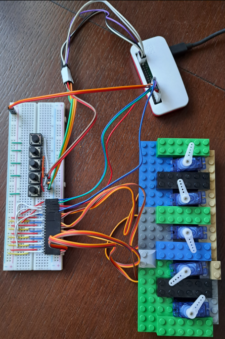
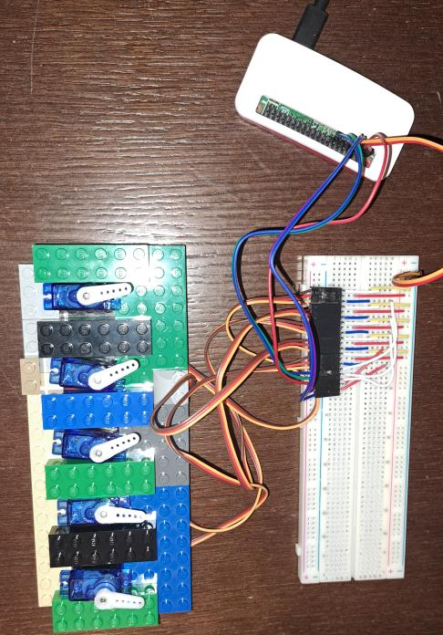

# Railway Switch

#### v0.4

Added second pair of of leds to show which track is set and which is not

#### v0.3

Leds added to show last direction

#### v0.2

Buttons added to trigger move of servo motors.

#### v0.1

Five python scripts to control five servo motors.

Purpose of that version is to check if conection to Pi is posible and scripts will control servo.
 

